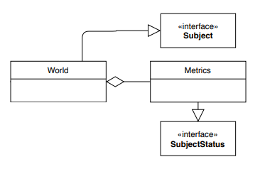
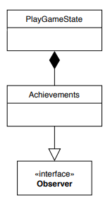

# Observer Design Pattern

**Obserwator** to _czynnościowy_, _bechawioralny_ wzorzec projektowy pozwalający na powiadomienie o zdarzeniu w aplikacji wielu obiektów obserwatorów. 

## Motywacja
Wzorzec obserwatora poprawia strukturę kodu poprzez oddzielenie od siebie funkcjonalności. Pozwala na powiadamianie innych obiektów o zmianie stanu oraz wykonanie w związku z tym określonej czynności. Przykładem mogłoby być zdarzenie o przerwaniu połączenia z bazą oraz próba jego ponowienia.

### Zastosowanie w grach:
Obserwator ma swoje zastosowanie w grach w przypadku implementacji systemu osiągnięć. Gry zwykle posiadają wiele różnych osiągnięć, odblokowywanych poprzez bardzo różne czynności. Bez wykorzystania wzorca obserwatora implementacja osiągnięć mogłaby szybko "rozprzestrzenić się" po całym kodzie gry, negatywnie wpływając na czystość kodu. Natomiast _obserwator_ sprawia, że możemy powiadamiać o różnych zdarzeniach w świecie gry, takich jak: zmiana pozycji gracza, modyfikacja obiektów, itd. Dzięki temu nie musimy zawierać kodu do obsługi osiągnięć np. w silniku fizyki.


## Diagram wykorzystania w grze OurCraft


<!--  -->

## Implementacja
Implementacja wzorca obserwatora składa się w podstawowej wersji z dwóch interfejsów: _Subject_ oraz _Observer_.  

Obiekt implementujący interfejs _Subject_ przechowuje listę wszystkich obiektów nasłuchujących (tzw. obserwatorów) oraz ma możliwość powiadamiania ich o dowolnym zdarzeniu dzięki metodzie `notifyAllObservers()`. Powoduje ona wywołanie na wszytkich obiektach obserwatorach metody `onUpdate()` z argumentem będącym zdarzeniem, o którym chcemy poinformować.


Definicja interfejsu _Subject_:
```java
public interface Subject {
    void addObserver(Observer toAdd);
    void removeObserver(Observer toRemove);

    void notifyAllObservers();
}
````

Definicja interfejsu _Observer_:
```java
public interface Observer {
    void onUpdate(SubjectStatus status);
}
```
